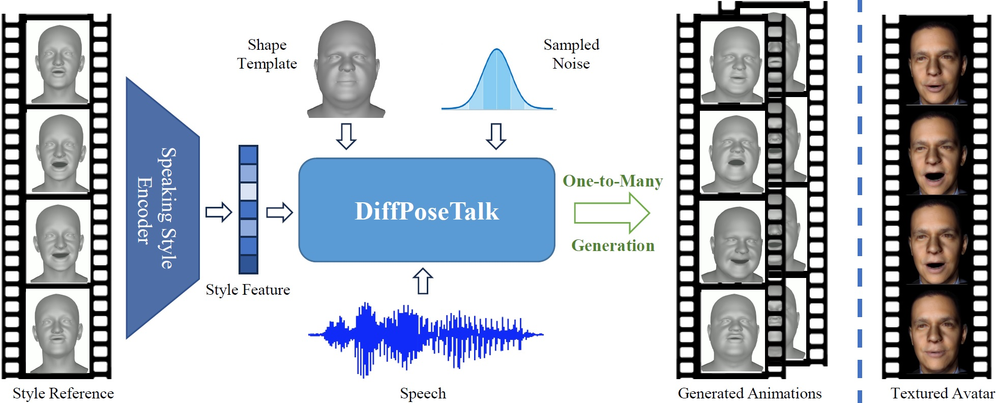

# DiffPoseTalk（Jittor）

<a href='https://arxiv.org/abs/2310.00434/'></a>

<a href='https://raineggplant.github.io/DiffPoseTalk/'></a>

DiffPoseTalk: Speech-Driven Stylistic 3D Facial Animation and Head Pose Generation via Diffusion Models



---

## Plan

- [x] Release the training and inference code
- [ ] Release the pretrained models


## Installation

### 1. Requirements

- **An NVIDIA GPU**. All shown results come from an RTX 3090.
- **Python**. python 3.9 is recommended.

### 2. Download FLAME-related files

```shell
bash ./setup/fetch_data.sh
```

After downloading the FLAME-related files, replace the `landmark_embedding.npy` file in the folder with the one from [here](https://drive.google.com/drive/folders/1djcYsdsJVTo90MubyRUfDrrbCHm3BSQu?usp=sharing).

### 3. Install dependencies

```
pip install -r requirements.txt
```

### 4. Download jittor-related libraries

Please download the required folders from [here](https://drive.google.com/drive/folders/1djcYsdsJVTo90MubyRUfDrrbCHm3BSQu?usp=sharing). The directory structure of downloaded folder is as following:

```shell
diffposetalk_requirement/
├── jittor/
│   ├── setup.py
│   └── ...
|
├── jtorch/
│   ├── setup.py
|   └── ...
|
├── transformers_jittor/
│   ├── setup.py
│   └── ...
└── ...
```

### 5. Compile the jittor-related libraries

After obtaining the ```diffposetalk_requirement``` folder, you need to compile all of them. Please run the following command in the same directory as the setup.py file in each of the libraries mentioned above:

```shell
pip install -e .
```

Note: Due to the dependencies between the components, it is best to compile in the order shown in above diagram.

## Datasets

(Optional) If you want to train with the `HDTF_TFHP`, please follow this [instruction](./datasets/HDTF_TFHP/README.md) to download the processed dataset.

## Inference

### Download the pre-trained model

You can download the pre-trained model of the Style Encoder from [here](https://drive.google.com/drive/folders/19-QqG6Fi5j6PcWL-I_If_Xb10qHsoUqN?usp=sharing), then please extract the files under the `./experiments` folder.

### 1. Extract Style Features

The style encoder can extract a style feature from an arbitray four-second motion sequence:

```shell
python extract_style.py --exp_name <STYLE_ENC_NAME> --iter <STYLE_ENC_ITER> -c <FLAME_MOTION_SEQ> -o <OUTPUT_NAME> -s <STARTING_FRAME>
```
Note that the `<FLAME_MOTION_SEQ>` should be a `.npz` file that has the `exp` and `pose` keys. The extracted style feature will be saved under the corresponding folder (`<STYLE_ENC_NAME>/<STYLE_ENC_ITER>`) under `demo/input/style`.

### 2. Generate Speech-Driven Animation

```shell
python demo.py --exp_name <DENOISING_NETWORK_NAME> --iter <DENOISING_NETWORK_ITER> -a <AUDIO> -c <SHAPE_TEMPLATE> -s <STYLE_FEATURE> -o <OUTPUT>.mp4 -n <N_REPITIONS> -ss <CFG_SCALE_FOR_STYLE> -sa <CFG_SCALE_FOR_AUDIO>
```

The `<SHAPE_TEMPLATE>` should be a `.npy` file containing a frame of shape parameter. The `<STYLE_ENC_NAME>/<STYLE_ENC_ITER>` in `<STYLE_FEATURE>`'s path can be omitted. 

You can also pass `--dtr 0.99` to enable dynamic thresholding to obtain results with better quality but lower diversity. 

Here are some examples:

```shell
python demo.py --exp_name head-SA-hubert-WM --iter 110000 -a demo/input/audio/FAST.flac -c demo/input/coef/TH217.npy demo/input/style/TH217.npy -o TH217-FAST-TH217.mp4 -n 3 -ss 3 -sa 1.15 -dtr 0.99
python demo.py --exp_name SA-hubert-WM --iter 100000 -a demo/input/audio/further_divide_our.flac -c demo/input/coef/TH050.npy -s demo/input/style/normal.npy -o TH050-further-normal.mp4 -n 3 -ss 3 -sa 1.15
```

## Training

Please note:
- The DiffPoseTalk system consists of a style encoder and a denoising network. You will need to train them one by one.

### 1. Train the Style Encoder

```shell
python main_se.py --exp_name <STYLE_ENC_NAME> --data_root <DATA_ROOT> [--no_head_pose]
```
The style encoder will be saved under the `experiments/SE/<STYLE_ENC_NAME>` folder. View the validation results in the TensorBoard to select the best model.

### 2. Train the Denoising Network

You will need to specify the path to the style encoder checkpoint using the `--style_enc_ckpt` argument. You can also experiment with different argument values and combinations.

```shell
python main_dpt.py --exp_name <DENOISING_NETWORK_NAME> --data_root <DATA_ROOT> --use_indicator --scheduler Warmup --audio_model hubert --style_enc_ckpt <PATH_TO_STYLE_ENC_CKPT> [--no_head_pose]
```

The denoising network will be saved under the `experiments/DPT/<exp_name>` folder. 

